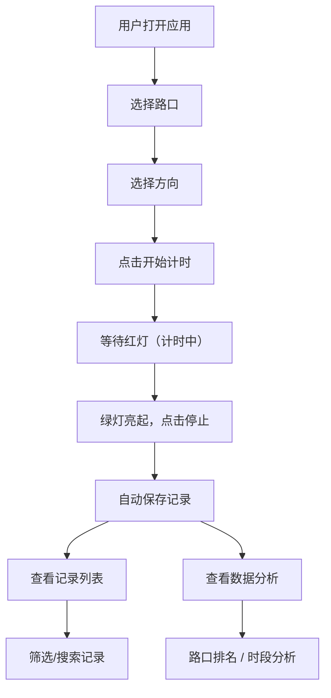

## 1. 产品概述

红绿灯等待时长公民记录工具是一款面向城市居民的数据收集应用。用户在路口等待红灯时一键开始计时，绿灯亮起时停止，系统自动记录等待时长、路口名称、方向和时段。通过众包数据汇总分析，揭示城市中哪些路口的红灯设计最不合理，为城市交通优化提供民间数据支持。

- 解决问题：城市红绿灯配时不合理导致的无效等待，缺乏民间数据反馈渠道
- 目标用户：城市通勤族、骑行者、行人、交通爱好者
- 产品价值：通过公民科学方式收集真实等待数据，推动城市交通治理优化

## 2. 核心功能

### 2.1 用户角色

| 角色 | 注册方式 | 核心权限 |
|------|----------|----------|
| 普通用户 | 无需注册，本地使用 | 记录等待时长、查看历史记录、查看数据分析、管理路口信息 |

### 2.2 功能模块

1. **计时首页**：一键开始/停止计时，实时显示等待时长，选择路口和方向
2. **记录列表**：历史等待记录查看、筛选、搜索、删除
3. **数据分析**：路口排名、时段分析、方向对比、趋势图表
4. **路口管理**：添加、编辑、删除路口信息，常用路口快捷选择

### 2.3 页面详情

| 页面名称 | 模块名称 | 功能描述 |
|----------|----------|----------|
| 计时首页 | 计时器模块 | 大数字显示等待时长，开始/停止按钮，状态指示（红灯/绿灯/待机） |
| 计时首页 | 路口选择 | 下拉选择常用路口，支持快速搜索，新增路口入口 |
| 计时首页 | 方向选择 | 东西南北方向选择按钮，记录行驶/行走方向 |
| 记录列表 | 记录卡片 | 展示每条记录的时长、路口、方向、日期时间 |
| 记录列表 | 筛选功能 | 按路口、时段、日期范围筛选记录 |
| 记录列表 | 统计概览 | 总记录数、平均等待时长、最长等待时长 |
| 数据分析 | 路口排名 | 按平均等待时长排名的路口列表，柱状图可视化 |
| 数据分析 | 时段分析 | 不同时段（早高峰/晚高峰/平峰）的平均等待时长对比 |
| 数据分析 | 方向对比 | 同一路口不同方向的等待时长差异分析 |
| 数据分析 | 趋势图表 | 近7天/30天等待时长变化趋势折线图 |
| 路口管理 | 路口列表 | 已保存路口的增删改查 |
| 路口管理 | 路口表单 | 路口名称、所属区域、备注信息录入 |

## 3. 核心流程

用户到达路口遇到红灯 → 打开应用选择路口和方向 → 点击开始计时 → 等待红灯 → 绿灯亮起点击停止 → 系统自动保存记录（时长、路口、方向、时间戳）→ 可在记录页查看历史 → 在分析页查看路口排名和趋势

## 4. 用户界面设计

### 4.1 设计风格

- **主色调**：交通信号灯主题色——红灯红 (#E53935)、黄灯黄 (#FDD835)、绿灯绿 (#43A047)
- **辅助色**：深灰蓝 (#37474F) 作为背景主色，营造专业沉稳的交通数据感
- **按钮风格**：大尺寸圆角按钮，按压时有明显的视觉反馈（缩放+阴影）
- **字体**：数字使用等宽字体，确保计时数字稳定不跳动；正文使用现代无衬线字体
- **布局风格**：卡片式布局，信息层级分明，关键数据大字号突出
- **图标风格**：线性图标，简洁明快，与交通主题呼应

### 4.2 页面设计概述

| 页面名称 | 模块名称 | UI元素 |
|----------|----------|--------|
| 计时首页 | 计时器模块 | 巨大的数字时钟（占屏幕核心位置），红灯/绿灯状态指示灯，开始/停止大按钮 |
| 计时首页 | 路口选择 | 搜索输入框 + 下拉列表，支持模糊匹配 |
| 计时首页 | 方向选择 | 四个方向按钮组成方向盘布局 |
| 记录列表 | 记录卡片 | 时间轴式布局，左侧显示时长大数字，右侧显示路口和方向信息 |
| 数据分析 | 图表区域 | 柱状图展示路口排名，配色使用交通灯三色渐变 |
| 路口管理 | 路口列表 | 列表式布局，带编辑和删除操作按钮 |

### 4.3 响应式

- 桌面端优先设计，同时适配移动端
- 移动端优化：计时器按钮更大更易点击，列表项简化显示
- 支持触控操作，按钮最小触控区域 48px
- 横屏模式下计时器数字自适应放大

### 4.4 动效设计

- 计时器开始/停止时有平滑的数字滚动动画
- 红灯→绿灯状态切换时有灯光渐变效果
- 页面切换使用淡入淡出过渡
- 数据加载时有骨架屏或加载动画
