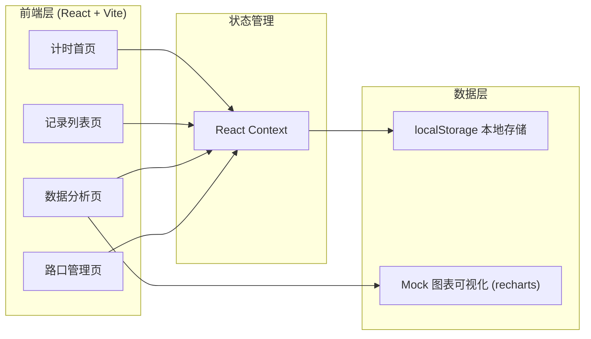
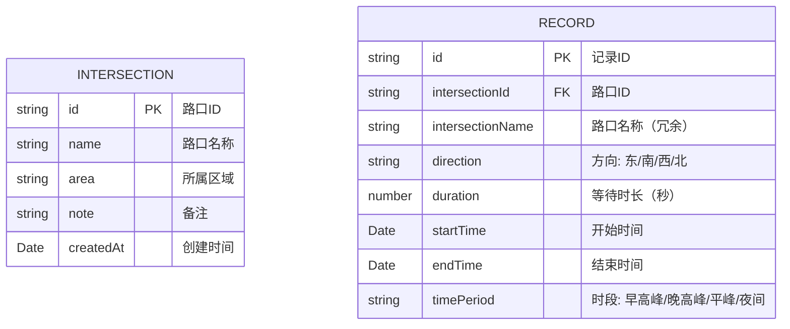

## 1. 架构设计

纯前端应用，数据存储在浏览器本地 localStorage，无需后端服务。



## 2. 技术描述

- **前端框架**: React@18 + TypeScript
- **构建工具**: Vite@5
- **样式方案**: TailwindCSS@3
- **路由管理**: React Router@6
- **图表库**: Recharts
- **图标库**: Lucide React
- **状态管理: React Context + useReducer
- **数据存储**: localStorage（本地持久化）
- **日期处理**: date-fns
- **初始化方式**: 使用 Vite 初始化 React + TypeScript 模板

## 3. 路由定义

| 路由 | 页面 | 说明 |
|------|------|------|
| / | 计时首页 | 计时器主界面，开始/停止计时，选择路口和方向 |
| /records | 记录列表 | 历史等待记录，支持筛选和删除 |
| /analysis | 数据分析 | 路口排名、时段分析、趋势图表 |
| /intersections | 路口管理 | 路口信息的增删改查 |

## 4. 数据模型

### 4.1 数据模型定义



### 4.2 TypeScript 类型定义

```typescript
// 路口类型
interface Intersection {
  id: string;
  name: string;
  area: string;
  note?: string;
  createdAt: string;
}

// 方向枚举
type Direction = 'east' | 'south' | 'west' | 'north';

// 时段枚举
type TimePeriod = 'morning_peak' | 'evening_peak' | 'flat' | 'night';

// 记录类型
interface WaitRecord {
  id: string;
  intersectionId: string;
  intersectionName: string;
  direction: Direction;
  duration: number; // seconds
  startTime: string; // ISO string
  endTime: string; // ISO string
  timePeriod: TimePeriod;
}

// 计时器状态
type TimerStatus = 'idle' | 'running' | 'stopped';
```

## 5. 核心模块划分

| 模块 | 文件路径 | 说明 |
|------|--------|------|
| TimerContext | src/context/TimerContext.tsx | 全局计时器状态管理 |
| DataContext | src/context/DataContext.tsx | 路口和记录数据管理 |
| Timer | src/components/Timer.tsx | 计时器组件 |
| IntersectionSelector | src/components/IntersectionSelector.tsx | 路口选择器 |
| DirectionSelector | src/components/DirectionSelector.tsx | 方向选择器 |
| RecordList | src/components/RecordList.tsx | 记录列表组件 |
| AnalysisCharts | src/components/AnalysisCharts.tsx | 数据分析图表 |
| useLocalStorage | src/hooks/useLocalStorage.ts | 本地存储 Hook |
| timeUtils | src/utils/timeUtils.ts | 时间处理工具函数 |
| mockData | src/data/mockData.ts | Mock 数据 |
